# 🛡 Adaptive Microservice Firewall Lab  
** Docker • Python • Layer-7 WAF Simulation**

A complete **attack–defense cybersecurity lab** that simulates real-world web attacks and enforces an **adaptive Layer-7 firewall** using Python and Docker.  
The project demonstrates **DoS mitigation, SQLi/XSS/CSRF detection, adaptive rate limiting, threat scoring, and historical attack logging**, visualized through a real-time security dashboard.

---

##  Project Overview

This lab recreates a realistic microservice environment with:

- **Firewall (Reverse Proxy / WAF)** inspecting all inbound traffic  
- **Victim Flask Application** protected behind the firewall  
- **Attacker Container** generating high-volume malicious traffic  
- **Live Security Dashboard** for monitoring attacks & defenses  

The firewall adapts dynamically based on **traffic history and threat score**, escalating actions from **allow → throttle → block**.

---

##  Security Capabilities

- **Layer-7 DoS Protection** (HTTP Flood / Refresh Flood)
- **Adaptive Rate Limiting** with threat-score based thresholds
- **SQL Injection Detection** (regex signature based)
- **XSS Detection** (script, JS, DOM-based patterns)
- **CSRF Heuristics** (Origin / Referer validation)
- **Temporary IP Banning** with decay & recovery
- **Attack History Logging** (timeline of events)
- **Real-Time Visualization Dashboard**

---

##  System Architecture
```bash
Browser ──> Firewall (8080) ──> Victim App (8000)
│
├── Traffic Inspection (SQLi / XSS / CSRF)
├── Adaptive Rate Limiter
├── Threat Score Engine
└── Live Dashboard (/dashboard)

Attacker Container ──> Firewall (HTTP Flood)
```
---

##  Directory Structure
```bash
Adaptive_Microservice_Firewall_lab
├── attacker/
│   ├── attack.py
│   ├── Dockerfile
│   └── fire/
├── firewall_app/
│   ├── templates/
│   │   ├── dashboard.html
│   │   └── index.html
│   ├── app.py
│   ├── Dockerfile
│   └── signatures.py
├── Output/ [...]
├── victim_app/
│   ├── app.py
│   └── Dockerfile
├── .gitignore
├── desktop.ini
├── docker-compose.yml
├── README.md
└── requirements.txt
```
---

## Project Screenshots

This section demonstrates the firewall detection capabilities and the monitoring interface during various attack simulations.

---

### Monitoring Dashboards

**Normal Operation**
<br>
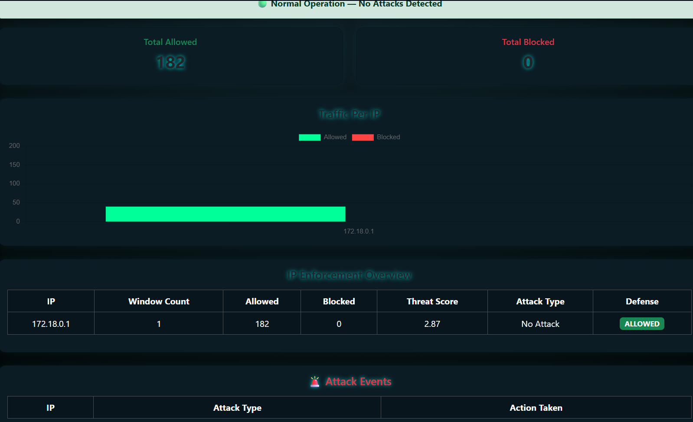
<br> 
The dashboard showing the system state when no threats are detected.
<br>

**Attack Blocked View**
<br>
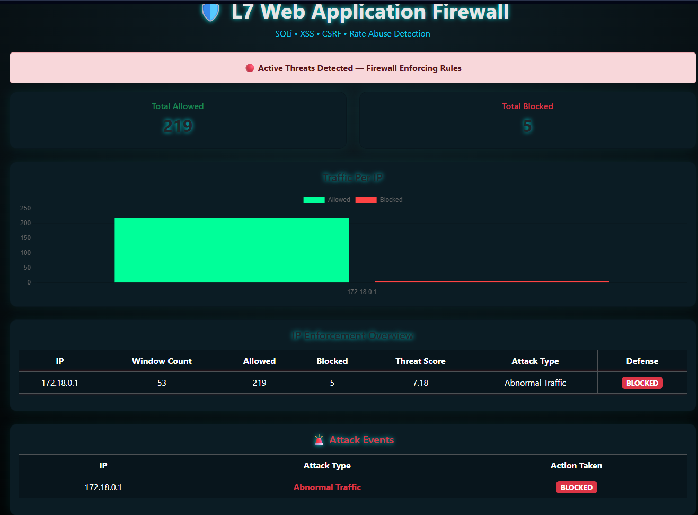
<br>
The visual alert triggered on the dashboard when the firewall intercepts a malicious request.

---

### Blocked Security Threats

**SQL Injection (SQLi)**

The firewall identifies and drops requests containing SQL injection patterns.

* Interception Result:<br> 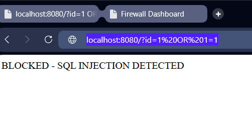 <br>
* Dashboard Alert:<br> 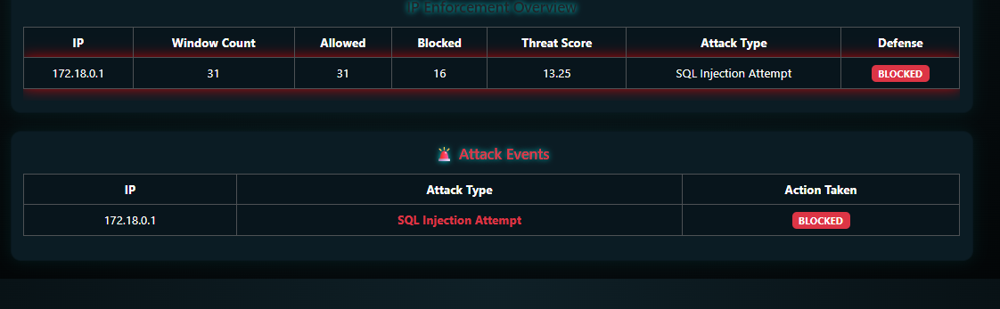 <br>

---

**Cross-Site Scripting (XSS)**

Prevention of script injection attacks through request filtering.

* Interception Result:<br> 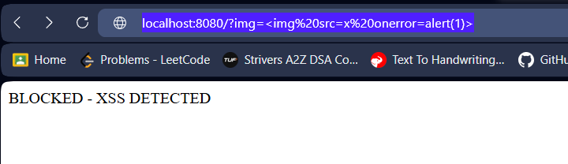<br>
* Dashboard Alert:<br> 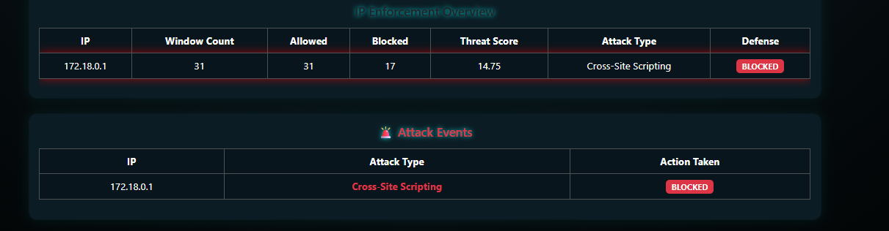<br>

---

**Cross-Site Request Forgery (CSRF)**

Detection of unauthorized POST requests or missing CSRF tokens.

* Interception Result:<br> 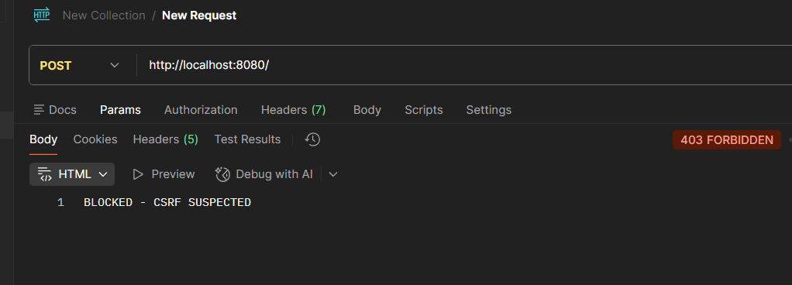<br>
* Dashboard Alert:<br> 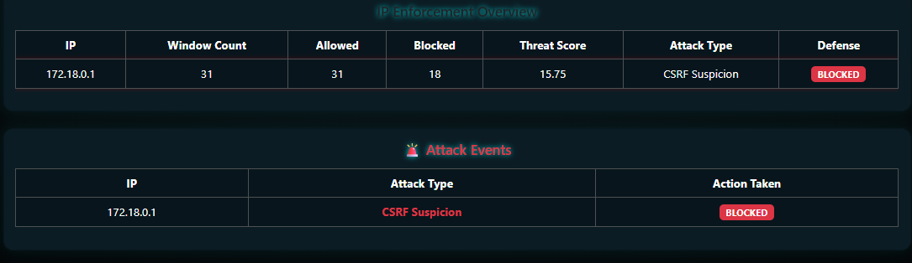<br>

---

**Traffic Throttling and Rate Limiting**

Mitigation of request overloads to prevent service exhaustion.

* Interception Result:<br> 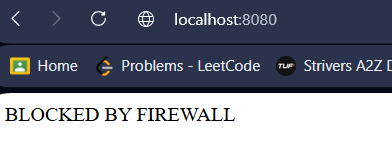<br>
* Dashboard Alert:<br> 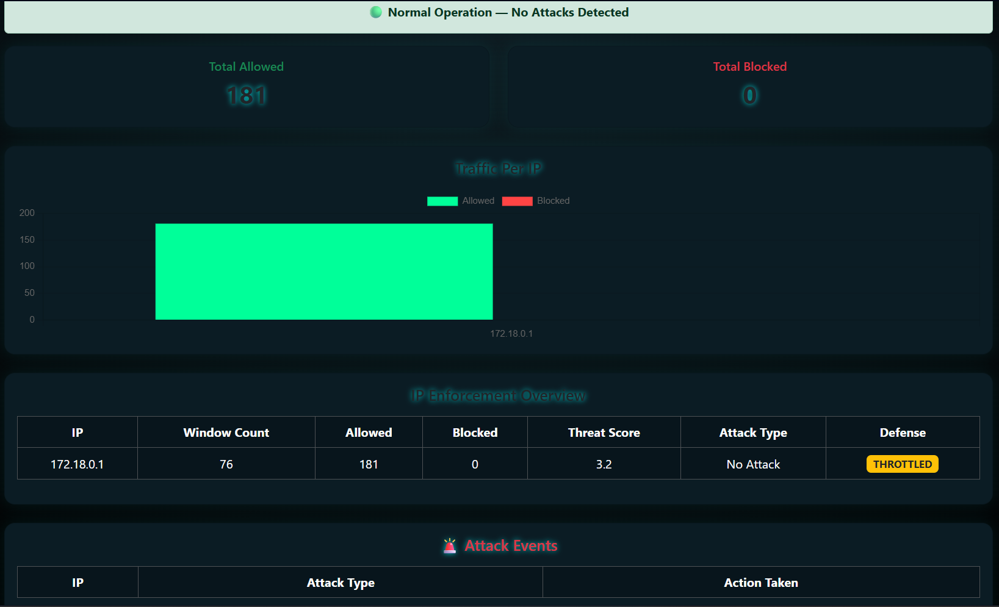<br>

---

### System Environment

**Host Status**
<br>
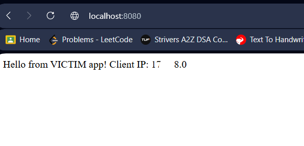
<br>
Confirmation of the host environment state during baseline testing.
---

##  How to Run

### 1️⃣ Build Containers
```bash
docker compose build
```
### 2️⃣ Start Firewall & Victim
```bash
docker compose up -d
```
### 3️⃣ Verify
```bash
docker ps
```
##  Access Points

Firewall Proxy: http://localhost:8080
Security Dashboard: http://localhost:8080/dashboard

### Dashboard updates every 2 seconds and shows:
Allowed vs Blocked traffic
Per-IP enforcement
Threat scores
Attack history timeline

##  Launch Attack (Manual)
```bash
docker compose --profile manual run --rm attacker
```
### Expected result:
Initial requests allowed
Throttling begins
IP blocked (403)
Dashboard flags active threats

##  Firewall Decision Logic
| Condition        | Action          |
| ---------------- | --------------- |
| Low traffic      | Allow           |
| Suspicious burst | Throttle        |
| Sustained abuse  | Block IP        |
| SQLi / XSS       | Instant block   |
| Repeated CSRF    | Escalated block |

Threat score decays over time, allowing recovery for legitimate clients.

##  Useful Commands
```bash
docker compose down
docker logs -f firewall_app
docker logs -f victim_app
docker system prune -f
```

##  Learning Outcomes

- Practical DoS & WAF internals
- Reverse proxy firewall design
- Adaptive security based on traffic history
- Docker microservice networking
- Real-time cyber attack visualization
- Interview-ready cybersecurity project
